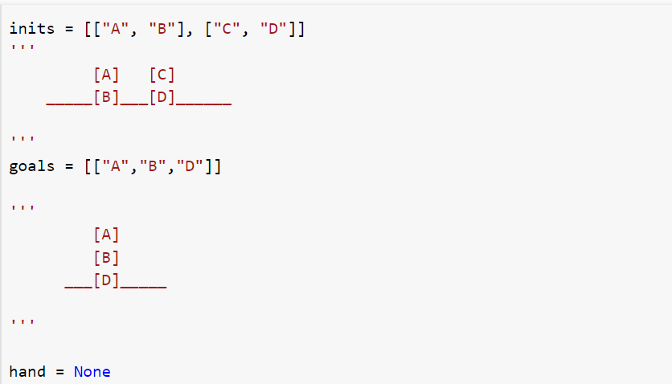
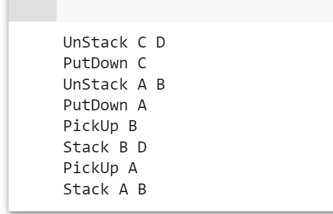

# Goal Stack Planning
Basic Idea to handle interactive compound goals uses goal stacks, Here the stack contains :

goals,
operators -- ADD, DELETE and PREREQUISITE lists
a database maintaining the current situation for each operator used.
Consider the following where wish to proceed from the start to goal state.

# Input:

# Output:

# What is the Blocks World? -- The world consists of:

A flat surface such as a tabletop
An adequate set of identical blocks which are identified by letters.
The blocks can be stacked one on one to form towers of apparently unlimited height.
The stacking is achieved using a robot arm which has fundamental operations and states which can be assessed using logic and combined using logical operations.
The robot can hold one block at a time and only one block can be moved at a time.

# We shall use the four actions:

UNSTACK(A,B)
-- pick up clear block A from block B;

STACK(A,B)
-- place block A using the arm onto clear block B;

PICKUP(A)
-- lift clear block A with the empty arm;

PUTDOWN(A)
-- place the held block A onto a free space on the table.

# and the five predicates:

ON(A,B)
-- block A is on block B.

ONTABLE(A)
-- block A is on the table.

CLEAR(A)
-- block A has nothing on it.

HOLDING(A)
-- the arm holds block A.

ARMEMPTY
-- the arm holds nothing.
